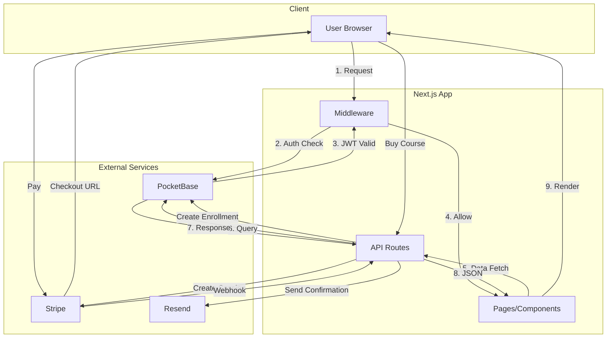

# KitaWorksHub LMS - Architecture Documentation

**Version:** 1.0.0
**Last Updated:** January 2026
**Target Audience:** Developers, System Architects, DevOps

---

## 1. System Overview

**KitaWorksHub** is a specialized Learning Management System (LMS) and Event Platform tailored for the Malaysian market. It bridges the gap between corporate training providers and businesses/individuals seeking professional development.

### Target Users
- **Malaysian Businesses** - Corporate training and PMO setup
- **Project Managers** - Professional certification courses
- **Team Leaders** - Leadership development programs

### Key Features
- **Course Delivery:** Video, text, quizzes, live classes
- **Event Management:** Workshops, seminars, webinars
- **Localization:** MYR currency, FPX payments, MY timezone
- **Gamification:** XP-based progression system
- **Certificates:** Verifiable digital credentials

### User Roles
| Role | Access |
|------|--------|
| **Student** | Courses, events, certificates, progress |
| **Instructor** | Course creation, student analytics |
| **Admin** | Full platform management |

---

## 2. Tech Stack

```
┌─────────────────────────────────────────────────────────────┐
│                      FRONTEND                                │
├─────────────────────────────────────────────────────────────┤
│  Next.js 16 (App Router) + React 19 + TypeScript 5.x        │
│  Tailwind CSS + Shadcn/ui + GSAP Animations                 │
│  React Hook Form + Zod Validation                           │
└─────────────────────────────────────────────────────────────┘
                              │
                              ▼
┌─────────────────────────────────────────────────────────────┐
│                    API LAYER                                 │
├─────────────────────────────────────────────────────────────┤
│  Next.js API Routes (Edge/Serverless)                       │
│  JWT Authentication via PocketBase                          │
│  Stripe Webhook Handlers                                    │
└─────────────────────────────────────────────────────────────┘
                              │
                              ▼
┌─────────────────────────────────────────────────────────────┐
│                  BACKEND SERVICES                            │
├─────────────────────────────────────────────────────────────┤
│  PocketBase BaaS (Auth + Database + Realtime + Storage)     │
│  Stripe (Payments: Card, FPX)                               │
│  Resend (Transactional Emails)                              │
└─────────────────────────────────────────────────────────────┘
```

### Dependencies
```json
{
  "next": "16.x",
  "react": "19.x",
  "typescript": "5.x",
  "pocketbase": "0.x",
  "stripe": "17.x",
  "gsap": "3.x",
  "tailwindcss": "4.x",
  "@react-pdf/renderer": "4.x"
}
```

---

## 3. Architecture Diagram

```
┌──────────────────────────────────────────────────────────────────────┐
│                           CLIENT LAYER                                │
│  ┌─────────────┐  ┌─────────────┐  ┌─────────────┐                   │
│  │   Browser   │  │   Mobile    │  │    PWA      │                   │
│  └──────┬──────┘  └──────┬──────┘  └──────┬──────┘                   │
└─────────┼────────────────┼────────────────┼──────────────────────────┘
          │                │                │
          └────────────────┼────────────────┘
                           │ HTTPS
                           ▼
┌──────────────────────────────────────────────────────────────────────┐
│                      VERCEL EDGE NETWORK                              │
│  ┌────────────────────────────────────────────────────────────────┐  │
│  │                    Next.js 16 Application                       │  │
│  │  ┌──────────────┐  ┌──────────────┐  ┌──────────────┐          │  │
│  │  │  App Router  │  │  API Routes  │  │  Middleware  │          │  │
│  │  │   (SSR/CSR)  │  │  (REST API)  │  │  (Auth/RBAC) │          │  │
│  │  └──────────────┘  └──────────────┘  └──────────────┘          │  │
│  └────────────────────────────────────────────────────────────────┘  │
└──────────────────────────────────────────────────────────────────────┘
                           │
          ┌────────────────┼────────────────┐
          │                │                │
          ▼                ▼                ▼
┌─────────────────┐ ┌─────────────────┐ ┌─────────────────┐
│   POCKETBASE    │ │     STRIPE      │ │     RESEND      │
│  ┌───────────┐  │ │  ┌───────────┐  │ │  ┌───────────┐  │
│  │   Auth    │  │ │  │ Checkout  │  │ │  │  Email    │  │
│  │  (JWT)    │  │ │  │  Session  │  │ │  │ Templates │  │
│  ├───────────┤  │ │  ├───────────┤  │ │  └───────────┘  │
│  │  SQLite   │  │ │  │  Webhooks │  │ └─────────────────┘
│  │ Database  │  │ │  │ (Payment) │  │
│  ├───────────┤  │ │  ├───────────┤  │
│  │   File    │  │ │  │ FPX + Card│  │
│  │  Storage  │  │ │  │  Support  │  │
│  ├───────────┤  │ │  └───────────┘  │
│  │ Realtime  │  │ └─────────────────┘
│  │(WebSocket)│  │
│  └───────────┘  │
└─────────────────┘
```

### Data Flow Diagram



---

## 4. Directory Structure

```
kitaworkshub/
├── app/                              # Next.js App Router
│   ├── (public)/                     # Public marketing pages
│   │   ├── page.tsx                  # Homepage
│   │   ├── courses/                  # Course catalog
│   │   ├── events/                   # Event listings
│   │   ├── services/                 # Service offerings
│   │   └── contact/                  # Contact form
│   │
│   ├── portal/                       # Protected student area
│   │   ├── layout.tsx                # Portal layout with sidebar
│   │   ├── dashboard/                # Student dashboard
│   │   ├── courses/                  # Enrolled courses
│   │   │   └── [slug]/
│   │   │       └── focus/            # Focus mode learning
│   │   ├── certificates/             # Earned certificates
│   │   └── profile/                  # User settings
│   │
│   ├── admin/                        # Admin dashboard
│   │   ├── layout.tsx
│   │   ├── dashboard/
│   │   ├── courses/
│   │   ├── events/
│   │   ├── users/
│   │   └── analytics/
│   │
│   ├── api/                          # API Routes
│   │   ├── auth/
│   │   │   ├── login/route.ts
│   │   │   ├── register/route.ts
│   │   │   ├── logout/route.ts
│   │   │   └── me/route.ts
│   │   ├── courses/
│   │   │   ├── route.ts              # GET list, POST create
│   │   │   └── [slug]/
│   │   │       ├── route.ts          # GET, PATCH, DELETE
│   │   │       └── enroll/route.ts   # POST enrollment
│   │   ├── events/
│   │   │   ├── route.ts
│   │   │   └── [slug]/
│   │   │       ├── route.ts
│   │   │       └── register/route.ts
│   │   ├── payments/
│   │   │   ├── create-session/route.ts
│   │   │   └── webhook/route.ts
│   │   ├── progress/
│   │   │   ├── route.ts
│   │   │   └── [lessonId]/
│   │   │       └── complete/route.ts
│   │   └── gamification/
│   │       ├── xp/route.ts
│   │       └── leaderboard/route.ts
│   │
│   ├── layout.tsx                    # Root layout
│   ├── globals.css                   # Global styles
│   └── error.tsx                     # Error boundary
│
├── components/                       # React Components
│   ├── ui/                           # Shadcn/Primitives
│   │   ├── button.tsx
│   │   ├── card.tsx
│   │   └── ...
│   ├── animations/                   # GSAP Components
│   │   ├── ScrollReveal.tsx
│   │   ├── TextReveal.tsx
│   │   └── AnimationProvider.tsx
│   ├── layout/                       # Layout Components
│   │   ├── Navigation.tsx
│   │   ├── Footer.tsx
│   │   └── Sidebar.tsx
│   └── features/                     # Feature Components
│       ├── CourseCard.tsx
│       ├── EventCard.tsx
│       └── LessonPlayer.tsx
│
├── lib/                              # Core Utilities
│   ├── pb.ts                         # PocketBase client
│   ├── auth.ts                       # Auth utilities
│   ├── stripe.ts                     # Stripe client
│   ├── progress.ts                   # Progress tracking
│   ├── gamification.ts               # XP/badges/levels
│   ├── db/
│   │   └── schema.ts                 # TypeScript types
│   └── hooks/
│       └── useProgress.ts            # Progress hook
│
├── public/                           # Static assets
│   ├── fonts/
│   └── images/
│
├── docs/                             # Documentation
│   └── ARCHITECTURE.md               # This file
│
└── package.json
```

---

## 5. Database Schema

### Collections (12 total)

```
┌─────────────────────────────────────────────────────────────┐
│                     CORE ENTITIES                            │
├─────────────────────────────────────────────────────────────┤
│                                                              │
│  ┌─────────┐      ┌─────────┐      ┌─────────┐              │
│  │  users  │──┐   │ courses │──┐   │ events  │              │
│  └─────────┘  │   └─────────┘  │   └─────────┘              │
│               │        │       │        │                    │
│               │        ▼       │        ▼                    │
│               │   ┌─────────┐  │   ┌──────────────┐         │
│               │   │ modules │  │   │ registrations│         │
│               │   └─────────┘  │   └──────────────┘         │
│               │        │       │                             │
│               │        ▼       │                             │
│               │   ┌─────────┐  │                             │
│               │   │ lessons │  │                             │
│               │   └─────────┘  │                             │
│               │                │                             │
│               ▼                ▼                             │
│         ┌───────────┐    ┌──────────┐                       │
│         │enrollments│───▶│ progress │                       │
│         └───────────┘    └──────────┘                       │
│               │                                              │
│               ▼                                              │
│        ┌─────────────┐                                      │
│        │ certificates│                                      │
│        └─────────────┘                                      │
│                                                              │
├─────────────────────────────────────────────────────────────┤
│                    GAMIFICATION                              │
├─────────────────────────────────────────────────────────────┤
│                                                              │
│  ┌─────────┐      ┌─────────────┐                           │
│  │ badges  │◀────▶│ user_badges │                           │
│  └─────────┘      └─────────────┘                           │
│                                                              │
├─────────────────────────────────────────────────────────────┤
│                     PAYMENTS                                 │
├─────────────────────────────────────────────────────────────┤
│                                                              │
│  ┌──────────┐                                               │
│  │ payments │ ─── Tracks all Stripe transactions            │
│  └──────────┘                                               │
│                                                              │
└─────────────────────────────────────────────────────────────┘
```

### Schema Details

| Collection | Key Fields | Relations |
|------------|-----------|-----------|
| `users` | email, name, role, xp_points, level | - |
| `courses` | title, slug, price, instructor | → users |
| `modules` | title, order | → courses |
| `lessons` | title, type, content, video_url | → modules |
| `enrollments` | enrolled_at, progress_percent | → users, courses |
| `progress` | completed_at, time_spent_sec | → enrollments, lessons |
| `events` | title, date, time, capacity, price | → users (host) |
| `registrations` | registered_at, attended | → users, events |
| `certificates` | credential_id, issued_at, pdf_url | → enrollments |
| `payments` | amount, currency, status, stripe_session_id | → users, courses/events |
| `badges` | name, icon, xp_reward, criteria | - |
| `user_badges` | earned_at | → users, badges |

---

## 6. API Architecture

### RESTful Endpoints

```
/api
├── /auth
│   ├── POST /login          → Authenticate user, set JWT cookie
│   ├── POST /register       → Create new user account
│   ├── POST /logout         → Clear session
│   └── GET  /me             → Get current user profile
│
├── /courses
│   ├── GET  /               → List published courses
│   ├── POST /               → Create course (instructor)
│   └── /[slug]
│       ├── GET              → Course details + modules
│       ├── PATCH            → Update course (instructor)
│       ├── DELETE           → Delete course (admin)
│       └── POST /enroll     → Enroll authenticated user
│
├── /events
│   ├── GET  /               → List upcoming events
│   ├── POST /               → Create event
│   └── /[slug]
│       ├── GET              → Event details
│       ├── PATCH            → Update event
│       ├── DELETE           → Delete event
│       └── /register
│           ├── POST         → Register for event
│           └── DELETE       → Cancel registration
│
├── /payments
│   ├── POST /create-session → Create Stripe checkout
│   └── POST /webhook        → Handle Stripe events
│
├── /progress
│   ├── GET  /               → User's overall progress
│   ├── POST /               → Track lesson progress
│   └── /[lessonId]
│       └── POST /complete   → Mark lesson complete + award XP
│
└── /gamification
    ├── GET  /xp             → User's XP and level
    ├── POST /xp             → Award XP (admin)
    └── GET  /leaderboard    → Top users by XP
```

### Response Format

```typescript
// Success Response
{
  success: true,
  data: { ... }
}

// Error Response
{
  success: false,
  message: "Error description"
}
```

---

## 7. Authentication Flow

```
┌─────────────────────────────────────────────────────────────┐
│                    AUTHENTICATION FLOW                       │
└─────────────────────────────────────────────────────────────┘

┌─────────┐     ┌─────────────┐     ┌─────────────┐     ┌──────────┐
│  User   │     │  Next.js    │     │  PocketBase │     │  Cookie  │
│ Browser │     │  API Route  │     │    Auth     │     │  Store   │
└────┬────┘     └──────┬──────┘     └──────┬──────┘     └────┬─────┘
     │                 │                   │                  │
     │  1. POST /login │                   │                  │
     │  {email, pass}  │                   │                  │
     │────────────────▶│                   │                  │
     │                 │                   │                  │
     │                 │ 2. authWithPassword()                │
     │                 │──────────────────▶│                  │
     │                 │                   │                  │
     │                 │ 3. { token, user }│                  │
     │                 │◀──────────────────│                  │
     │                 │                   │                  │
     │                 │ 4. Set HttpOnly Cookie               │
     │                 │─────────────────────────────────────▶│
     │                 │                   │                  │
     │  5. 200 OK      │                   │                  │
     │  { user data }  │                   │                  │
     │◀────────────────│                   │                  │
     │                 │                   │                  │
     │  6. Subsequent requests include cookie automatically   │
     │─────────────────────────────────────────────────────▶ │
     │                 │                   │                  │
```

### Protected Routes

```typescript
// middleware.ts
export function middleware(request: NextRequest) {
  const token = request.cookies.get('pb_auth');

  if (request.nextUrl.pathname.startsWith('/portal')) {
    if (!token) {
      return NextResponse.redirect('/portal/login');
    }
  }

  if (request.nextUrl.pathname.startsWith('/admin')) {
    // Additional role check via API
  }
}
```

---

## 8. Payment Flow

```
┌─────────────────────────────────────────────────────────────┐
│                      PAYMENT FLOW                            │
│                   (Stripe + FPX Support)                     │
└─────────────────────────────────────────────────────────────┘

┌─────────┐     ┌─────────────┐     ┌─────────────┐     ┌──────────┐
│  User   │     │  Next.js    │     │   Stripe    │     │PocketBase│
│         │     │  API Route  │     │             │     │          │
└────┬────┘     └──────┬──────┘     └──────┬──────┘     └────┬─────┘
     │                 │                   │                  │
     │ 1. Click "Buy"  │                   │                  │
     │────────────────▶│                   │                  │
     │                 │                   │                  │
     │                 │ 2. Create Checkout Session            │
     │                 │   {price, metadata}                   │
     │                 │──────────────────▶│                  │
     │                 │                   │                  │
     │                 │ 3. { sessionUrl } │                  │
     │                 │◀──────────────────│                  │
     │                 │                   │                  │
     │ 4. Redirect to Stripe               │                  │
     │◀────────────────│                   │                  │
     │                 │                   │                  │
     │ 5. Pay (FPX/Card)                   │                  │
     │────────────────────────────────────▶│                  │
     │                 │                   │                  │
     │                 │ 6. Webhook: payment_intent.succeeded  │
     │                 │◀──────────────────│                  │
     │                 │                   │                  │
     │                 │ 7. Create enrollment                  │
     │                 │─────────────────────────────────────▶│
     │                 │                   │                  │
     │ 8. Redirect to success page         │                  │
     │◀──────────────────────────────────── │                  │
```

---

## 9. Gamification System

### XP Rewards Table

| Action | XP Awarded |
|--------|------------|
| Account Registration | +50 XP |
| Complete Lesson (text) | +10 XP |
| Complete Lesson (video) | +15 XP |
| Complete Lesson (quiz) | +25 XP |
| Complete Lesson (live) | +50 XP |
| Complete Course | +200 XP |
| Earn Certificate | +100 XP |
| Attend Event | +100 XP |

### Level Progression

```
Level 1: Newcomer      │    0 -   199 XP  │ ████░░░░░░
Level 2: Learner       │  200 -   499 XP  │ ██████░░░░
Level 3: Practitioner  │  500 -   999 XP  │ ████████░░
Level 4: Professional  │ 1000 -  1999 XP  │ ██████████
Level 5: Expert        │ 2000 -  4999 XP  │ ████████████
Level 6: Master        │ 5000 - 9999 XP   │ ██████████████
Level 7: Legend        │ 10000+ XP        │ ████████████████
```

### Badge System

| Badge | Criteria | XP Bonus |
|-------|----------|----------|
| First Steps | Complete first lesson | +50 |
| Course Completer | Complete any course | +100 |
| Speed Learner | Complete 3 lessons in a day | +75 |
| Event Enthusiast | Attend 3 events | +150 |
| Perfect Score | 100% on any quiz | +100 |
| Dedicated Learner | 7-day login streak | +200 |

---

## 10. Security Considerations

### Authentication
- JWT tokens stored in HttpOnly cookies (XSS resistant)
- Token refresh on activity
- Secure password hashing via PocketBase (bcrypt)

### Authorization
- Role-based access control (RBAC)
- Middleware protects routes by role
- API endpoints verify ownership

### Payment Security
- Stripe webhook signature verification
- No sensitive card data stored locally
- PCI DSS compliance via Stripe

### Data Protection
- HTTPS enforced (Vercel)
- Input validation with Zod schemas
- SQL injection prevented (PocketBase parameterized queries)

### Rate Limiting
- API routes protected against abuse
- Configurable limits per endpoint

---

## 11. Deployment Architecture

```
┌─────────────────────────────────────────────────────────────┐
│                     PRODUCTION                               │
└─────────────────────────────────────────────────────────────┘

┌─────────────────────────────────────────────────────────────┐
│                    VERCEL EDGE                               │
│  ┌─────────────────────────────────────────────────────┐    │
│  │  Next.js App (Serverless Functions)                 │    │
│  │  - SSR Pages                                        │    │
│  │  - API Routes                                       │    │
│  │  - Static Assets (CDN)                              │    │
│  └─────────────────────────────────────────────────────┘    │
└─────────────────────────────────────────────────────────────┘
                              │
                              ▼
┌─────────────────────────────────────────────────────────────┐
│                  VPS (DigitalOcean/Hetzner)                  │
│  ┌─────────────────────────────────────────────────────┐    │
│  │  Docker Container                                    │    │
│  │  ┌─────────────────────────────────────────────┐    │    │
│  │  │  PocketBase                                  │    │    │
│  │  │  - Port 8090                                 │    │    │
│  │  │  - SQLite Database                           │    │    │
│  │  │  - File Storage                              │    │    │
│  │  └─────────────────────────────────────────────┘    │    │
│  └─────────────────────────────────────────────────────┘    │
└─────────────────────────────────────────────────────────────┘
```

### Environment Variables

```bash
# .env.local
NEXT_PUBLIC_POCKETBASE_URL=https://pb.kitaworkshub.com.my
NEXT_PUBLIC_APP_URL=https://kitaworkshub.com.my

# Server-only
STRIPE_SECRET_KEY=sk_live_...
STRIPE_WEBHOOK_SECRET=whsec_...
RESEND_API_KEY=re_...
```

---

## 12. Performance Optimizations

- **Static Generation:** Marketing pages pre-rendered at build
- **Image Optimization:** Next.js Image component with AVIF/WebP
- **Code Splitting:** Dynamic imports for below-fold components
- **Font Optimization:** Preloaded, display: swap
- **CSS:** Tailwind purging, optimizeCss enabled
- **Caching:** SWR for client-side data fetching

---

*Last updated: January 2026*
