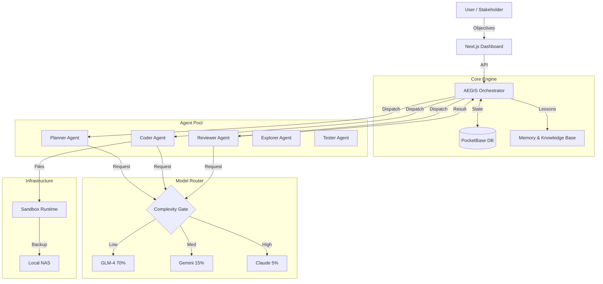

# Project AEGIS: Super System Architecture

**Autonomous Engineering & Generative Intelligence System**

---

## Executive Summary

**Project AEGIS** is a hyper-efficient, autonomous software factory designed to simulate the output of a 50-person engineering team at <1% of the operational cost.

The core philosophy is **"Token Arbitrage"**: We treat intelligence as a commodity. By strictly enforcing a **70/15/5** split across models (GLM/Gemini/Claude), AEGIS ensures that premium compute is never wasted on mundane tasks.

---

## Architecture Overview

### High-Level Data Flow

1. **Input:** High-level objective enters via Dashboard
2. **Planner:** Deconstructs objective into atomic Tasks (stored in PocketBase)
3. **Router:** Assigns an Agent and a Model Budget to each task
4. **Execution:** Agents execute code/commands
5. **Verification:** Tester/Reviewer agents validate output
6. **Merge/Commit:** Validated code is committed; Memory is updated

### System Diagram



---

## Cost Optimization Strategy

| Model | Allocation | Role | Examples |
|-------|------------|------|----------|
| **GLM-4** | **≥70%** | The Hands | Boilerplate, tests, formatting, logging |
| **Gemini Flash** | **~15%** | The Context | Large file analysis, research, prototyping |
| **Claude 3.5** | **≤5%** | The Brain | Architecture, security, complex debugging |

### Router Logic

```typescript
function routeModel(task: Task): Model {
  if (task.type === 'ARCHITECTURE' || task.priority === 'CRITICAL') return 'CLAUDE';
  if (task.contextLength > 100_000 || task.type === 'RESEARCH') return 'GEMINI';
  return 'GLM';
}
```

---

## Component Details

### A. Orchestrator (Core Engine)
- **Tech:** Node.js / TypeScript
- **Role:** Polls PocketBase for pending tasks, manages dependencies
- **Circuit Breakers:**
  - Cost Cap: Pauses if daily spend > $X
  - Loop Detection: Kills task after 3 failures
  - Hallucination Check: Regex validation before file writes

### B. Agent Pool

| Agent | Model | Purpose |
|-------|-------|---------|
| Explorer | Gemini | Scans codebase, maps territory |
| Planner | Claude | Breaks goals into JSON steps |
| Coder | GLM→Claude | Writes code (GLM drafts, Claude polishes) |
| Reviewer | Claude | Runs linters, type checks, logic review |
| Tester | GLM | Generates test cases |

### C. Memory System
- **Short-term:** Redis/In-Memory (current execution)
- **Long-term:** PocketBase `knowledge_base` collection
- **Schema:** `trigger`, `solution`, `outcome`, `embedding`

### D. Infrastructure
- **PocketBase:** Single binary database for Users, Tasks, Logs, Memories
- **NAS Integration:** Hourly rsync, nightly Docker backups

---

## Implementation Phases

### Phase 1: Foundation (Weeks 1-2)
- Setup PocketBase schema
- Build Next.js Dashboard
- Implement Router function
- Create Planner Agent

### Phase 2: The Loop (Weeks 3-4)
- Implement Coder Agent
- Build Reviewer Agent
- Enable GLM-first routing
- Setup Circuit Breakers

### Phase 3: Autonomy (Weeks 5-8)
- Self-Improvement cron job
- NAS Integration
- Memory Injection

---

## ROI Analysis

| Metric | Traditional (5 Devs) | AEGIS |
|--------|---------------------|-------|
| Staff Cost | $150,000 (3 mo) | $0 |
| API Cost | $500 | $2,000 |
| Speed | 40h/week | 168h/week |
| **Total** | **~$150,500** | **~$2,000** |
| **Efficiency** | 1x | **75x** |

---

## Integration Points

### KitaWorksHub Portal
- Collapsible sidebars (Admin/Portal)
- Loading skeletons for performance
- E2E test coverage

### Claude Command Center
- Autonomous Engine service
- Agent Pool management
- Tri-model routing
- Activity streaming

---

*Version 1.0.0 | December 2025*
